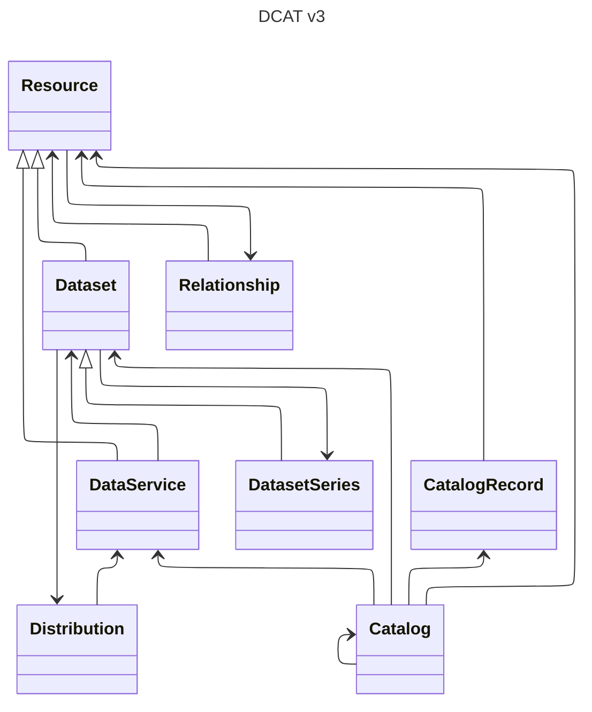
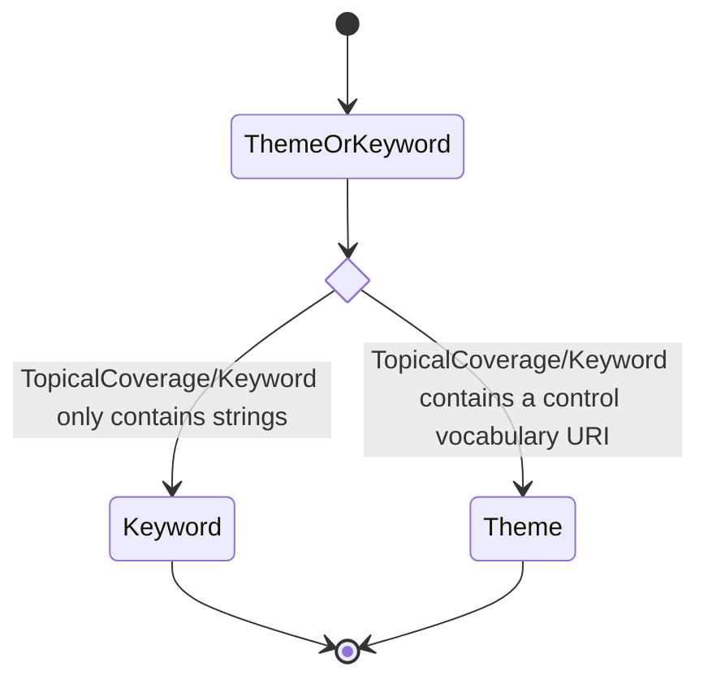

# Dedicate: Model-Level Mapping between DDI and DCAT

## Introduction

Here we document the model-level mapping between DDI and DCAT, or more precisely from the different DDI products (Codebook, Lifecycle and CDI) to DCAT.

Since the aim is to produce metadata conforming to DCAT profiles, the document is organized according to the DCAT model. Each main section corresponds to a DCAT class, and is further divided according to the DDI product which is source of the mapping.

The DCAT model is detailed [in the Recommendation](https://www.w3.org/TR/vocab-dcat-3/#fig-dcat-all-attributes); a summary view of its structure is given below.

## DCAT Resource

The DCAT Recommendation defines the [Resource class](https://www.w3.org/TR/vocab-dcat-3/#Class:Resource) by: "This class carries properties common to all cataloged resources, including datasets and data services". This class is mainly useful to catalog resources that are not datasets or data services, so we may ignore it in this mapping exercice. However, it bears a great number of properties that are inherited by Dataset and DataService. These properties will be studied in the next section.

## DCAT Dataset

The DCAT Recommendation defines the [Dataset class](https://www.w3.org/TR/vocab-dcat-3/#Class:Dataset) as a "collection of data, published or curated by a single agent, and available for access or download in one or more representations".

### Identification

❗️TODO document how to identify an DCAT Dataset (its URI)

### DDI Lifecycle

What DDI-L class corresponds to the DCAT Dataset?

How do we obtain the Dataset properties from DDI-L metadata? We can start with the properties that are actually used (recommended or mandatory) in well-established profiles like [DCAT-AP](https://semiceu.github.io/DCAT-AP/releases/3.0.1/). These are:

| Property          | Range        | DCAT-AP status |
| ----------------- | ------------ | -------------- |
| dct:title         | rdfs:Literal | mandatory      |
| dct:description   | rdfs:Literal | mandatory      |
| dcat:contactPoint | vcard:Kind   | recommended    |
| dcat:keyword      | rdfs:Literal | recommended    |
| dcat:theme        | skos:Concept | recommended    |

#### `dcat:title`

The StudyUnit `Citation/Title` and `Citation/Description` could be use for generating the `dct:title` and `dct:description`

Example: for a StudyUnit titled "National census 2026" we can have a Dataset with `dct:title` "Dataset for the National census 2026"

#### `dct:description`

We can use the same logic as above for `dcat:title`.

#### `dcat:contactPoint`

It is a `vcard:Kind`, so we could use `StudyUnit/Citation/Publisher/PublisherReference` which is a `Organization`, which contains a `ContactInformation`.

#### `dcat:keyword`

The StudyUnit `Coverage/TopicalCoverage/Keyword` using the available multi-language string values.

#### `dcat:theme`

According to the [DCAT-AP specification for Dataset](https://semiceu.github.io/DCAT-AP/releases/3.0.1/#Dataset), his property should use at least one concept from the [Data Theme controlled vocabulary](https://publications.europa.eu/resource/authority/data-theme).

Here, we should use the the `HEAL` concept, which is defined by:

> dataset theme covering the domain of health which includes health conditions, diseases, treatments, healthcare services, and health policies

The StudyUnit `Coverage/TopicalCoverage/Keyword` using the controlled vocabulary informations to produce a URI.

The following diagram summarizes the decision process:

## DCAT Distribution

The DCAT Recommendation defines the [Distribution class](https://www.w3.org/TR/vocab-dcat-3/#Class:Distribution) as follows:

"A specific representation of a dataset. A dataset might be available in multiple serializations that may differ in various ways, including natural language, media-type or format, schematic organization, temporal and spatial resolution, level of detail or profiles (which might specify any or all of the above)."

### DDI Lifecycle

What DDI-L class corresponds to the DCAT Distribution?

How do we obtain the Distribution properties from DDI-L metadata? As for the the dataset, we can start with properties used in DCAT-AP, which are:

| Property        | Range                 | DCAT-AP status |
| --------------- | --------------------- | -------------- |
| dcat:accessURL  | rdfs:Resource         | mandatory      |
| dct:description | rdfs:Literal          | recommended    |
| dct:format      | dct:MediaTypeOrExtent | recommended    |

> [!NOTE]  
> DCAT-AP also recommmends the "availability" property, but this is an extension not defined in DCAT.

How do we derive the property that links a dataset to a distribution?

#### `dcat:accessURL`

The `PhysicalInstance` class in Lifecycle has a [`DataFileIdentification`](https://ddialliance.github.io/ddimodel-web/DDI-L-3.3/composite-types/DataFileIdentificationType/) field for which the documentation explains:

> Identifies the data file documented in the physical instance and provides information about its location.

More specifically, `DataFileIdentification` has a `DataFileURI` property.

#### `dct:description`

For this, we should probably use the [`Citation`](https://ddialliance.github.io/ddimodel-web/DDI-L-3.3/composite-types/CitationType/) property. It provides several "DC-like" fields and the possibility to add any Dublin Core terms with `DCTerms` ([here](https://docs.ddialliance.org/DDI-Lifecycle/3.3/xmlschema/schemas/dc_xsd/elements/any.html) is the XML schema doc for this).

#### `dct:format`

The most direct way to implement this is to use as mentionned earlier the `Citation` element.

We could also consider the use of the `FileFormat` property of `PhysicalStructure`. The lattest is link to the `PhysicalInstance` through its `RecordLayout`.

## Catalog

The DCAT Recommendation defines the [Catalog](https://www.w3.org/TR/vocab-dcat-3/#Class:Catalog) as such:

"A curated collection of metadata about resources."

With two usage notes:

"A Web-based data catalog is typically represented as a single instance of this class."

"Datasets and data services are examples of resources in the context of a data catalog."

### DDI Lifecycle

[The DCAT-AP entry for Catalog](https://semiceu.github.io/DCAT-AP/releases/3.0.1/#Catalogue) defines these three mandatory properties:

| Property        | Range        | DCAT-AP status |
| --------------- | ------------ | -------------- |
| dct:title       | rdfs:Literal | mandatory      |
| dct:description | rdfs:Literal | mandatory      |
| dct:publisher   | dct:Agent    | mandatory      |

The DDI Lifecycle `Organization` is a good starting point for these informations.

#### `dct:title`

Here, a generated text of the form: "Catalog for [Organization/OrganizationIdentification/OrganizationName]" would be a good fit.

#### `dct:description`

Same as above.

#### `dct:publisher`

Here use the relevant information from Organisation that corresponds to the `dct:publisher` property.
