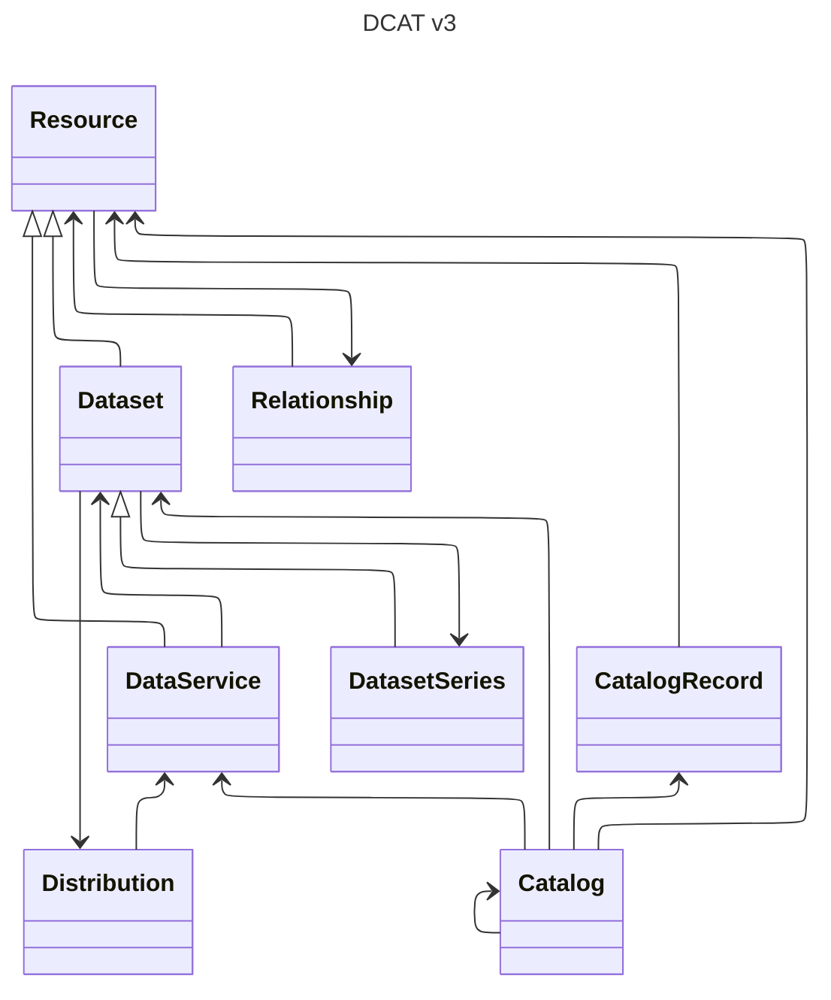

# Dedicate: Model-Level Mapping between DDI and DCAT

## Introduction

Here we document the model-level mapping between DDI and DCAT, or more precisely from the different DDI products (Codebook, Lifecycle and CDI) to DCAT.

Since the aim is to produce metadata conforming to DCAT profiles, the document is organized according to the DCAT model. Each main section corresponds to a DCAT class, and is further divided according to the DDI product which is source of the mapping.

The DCAT model is detailed [in the Recommendation](https://www.w3.org/TR/vocab-dcat-3/#fig-dcat-all-attributes); a summary view of its structure is given below.

## DCAT Resource

The DCAT Recommendation defines the [Resource class](https://www.w3.org/TR/vocab-dcat-3/#Class:Resource) by: "This class carries properties common to all cataloged resources, including datasets and data services". This class is mainly useful to catalog resources that are not datasets or data services, so we may ignore it in this mapping exercice. However, it bears a great number of properties that are inherited by Dataset and DataService. These properties will be studied in the next section.

## DCAT Dataset

The DCAT Recommendation defines the [Dataset class](https://www.w3.org/TR/vocab-dcat-3/#Class:Dataset) as a "collection of data, published or curated by a single agent, and available for access or download in one or more representations".

### DDI Lifecycle

What DDI-L class corresponds to the DCAT Dataset?

How do we obtain the Dataset properties from DDI-L metadata? We can start with the properties that are actually used (recommended or mandatory) in well-established profiles like [DCAT-AP](https://semiceu.github.io/DCAT-AP/releases/3.0.1/). These are:

| Property          | Range        | DCAT-AP status |
|-------------------|--------------|----------------|
| dct:title         | rdfs:Literal | mandatory      |
| dct:description   | rdfs:Literal | mandatory      |
| dcat:contactPoint | vcard:Kind   | recommended    |
| dcat:keyword      | rdfs:Literal | recommended    |
| dcat:theme        | xkos:Concept | recommended    |

## DCAT Distribution

The DCAT Recommendation defines the [Distribution class](https://www.w3.org/TR/vocab-dcat-3/#Class:Distribution) as follows:

"A specific representation of a dataset. A dataset might be available in multiple serializations that may differ in various ways, including natural language, media-type or format, schematic organization, temporal and spatial resolution, level of detail or profiles (which might specify any or all of the above)."

### DDI Lifecycle

What DDI-L class corresponds to the DCAT Distribution?

How do we obtain the Distribution properties from DDI-L metadata? As for the the dataset, we can start with properties used in DCAT-AP, which are:

| Property          | Range                 | DCAT-AP status |
|-------------------|-----------------------|----------------|
| dcat:accessURL    | rdfs:Resource         | mandatory      |
| dct:description   | rdfs:Literal          | recommended    |
| dct:format        | dct:MediaTypeOrExtent | recommended    |

> [!NOTE]  
> DCAT-AP also recommmends the "availability" property, but this is an extension not defined in DCAT.

How do we derive the property that links a dataset to a distribution?